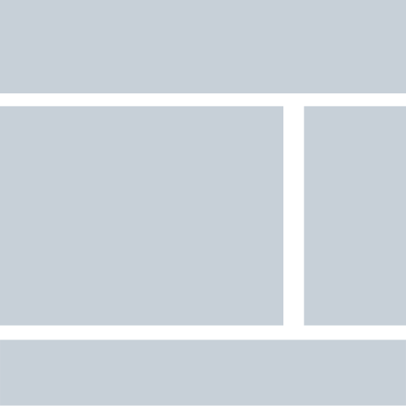

###### Projeto - DevMedia
________________________________________________________________________________________________________________________________________________
Este é um projeto criado pela empresa DevMedia para seus estagiários com a intenção de testar seus conhecimentos em relação ao HTML e CSS (semântica e estilização). Porem está é uma versão minha baseada nos materiais que a DevMedia disponibilizou gratuitamente.

### Pré-requisitos

Ter conhecimento em **HTML** (SEO básico e organização das *tags* semânticas) e **CSS** (Flex Layout, Grid Layout).

### Tecnologias

- [HTML](https://www.w3schools.com/html/)
- [CSS](https://www.w3schools.com/css/default.asp)

### Autor
________________________________________________________________________________________________________________________________________________

Feito por [Michael Santos](https://github.com/michael-santos-gith)

